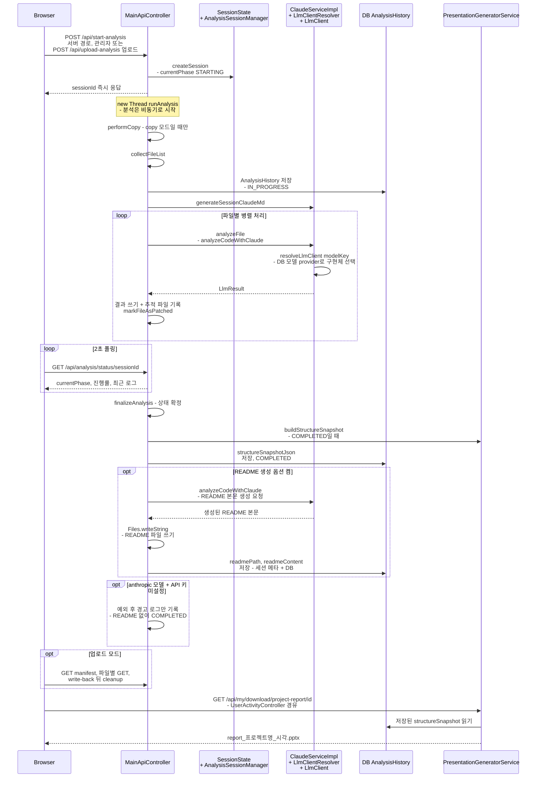
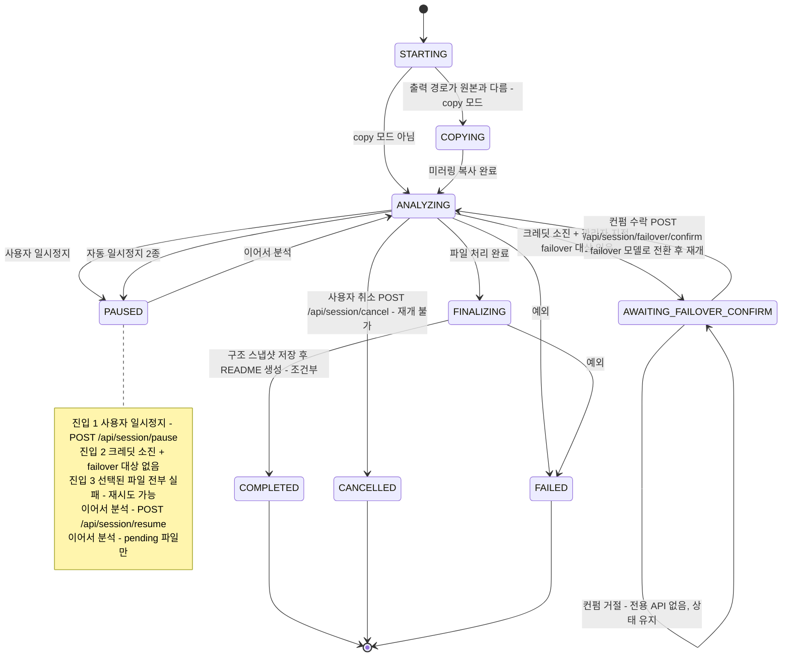
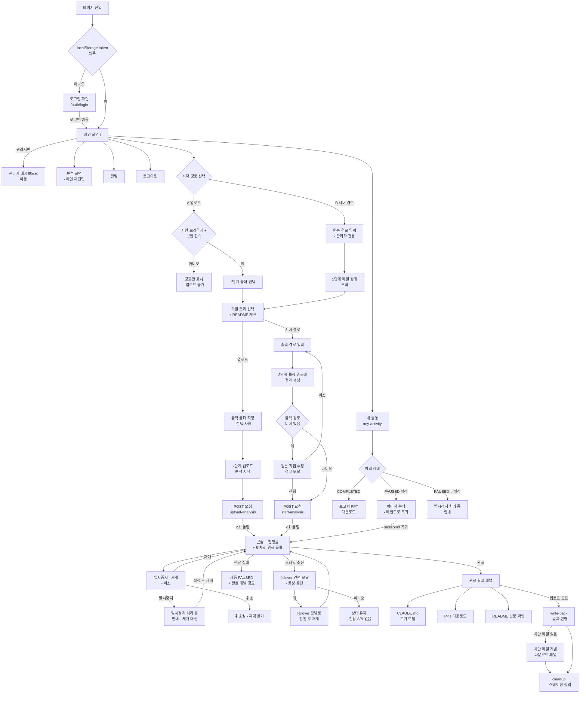

# 📚 프로젝트 문서

프로젝트 관련 모든 문서 및 리소스를 관리하는 디렉터리입니다.

> 시스템 전체 구조(도메인 모델/ERD, API 지도, 핵심 흐름, 설계 결정)를 한 번에 보려면
> 프로젝트 루트의 [`ARCHITECTURE.md`](../ARCHITECTURE.md)를 먼저 읽는 것을 권장한다.
> 아래 `docs/`는 개별 기능의 상세 구현·버그 수정 이력을 다룬다.
>
> 진행 중인 작업(Claude API ↔ 로컬/사내 LLM 전환, RAG)은 [`advancement/`](./advancement/) 참고 —
> 특히 [`advancement/0.status/handOff.md`](./advancement/0.status/handOff.md)가 현재 진척 상황 핸드오프 문서.

## 📁 구조

```
docs/
├── advancement/      ← 진행 중인 작업: Claude API ↔ 로컬/사내 LLM 전환, RAG(Chroma — A안 구조 압축·B안 코드 청킹)
│   ├── 0.status/handOff.md         ← 진행 현황 핸드오프 (세션 간 인계용, 가장 먼저 읽을 문서)
│   ├── 1.plan/plan.md              ← 인덱스 + 공통 설계
│   ├── 2.scenario/scenario_0~3.md  ← 배포 시나리오별 설계 워킹 드래프트
│   ├── 3.confirmed/scenario_N_confirmed.md  ← 스펙 확정 스냅샷
│   ├── 4.tested/scenario_N_test.md ← 구현 중 실제 검증 현황 추적
│   └── 5.completed/scenario_N_completed.md  ← 구현+테스트 완료 보고
│       (단계별 번호 폴더 구성 — 옛 `advancement/{plan,scenario,ing}/` 경로는 폐기됨)
├── guides/           ← 사용 가이드 및 튜토리얼
│   └── PowerPoint_변환가이드.md
├── technical/        ← 기술 문서 및 명세
│   ├── ANALYSIS_METRICS_DB_SCHEMA.md
│   ├── TOKEN_EXTRACTION_IMPLEMENTATION.md
│   ├── PARTIAL_ANALYSIS_AND_PPT_SNAPSHOT.md
│   └── SESSION_STATUS_CONSISTENCY_FIXES.md
└── README.md         ← 이 파일
```

---

## 🏗️ 프로젝트 전체 구조

### 분석 요청 시퀀스 (한눈에 보기)



요청을 받은 컨트롤러는 세션을 만들고 `sessionId`를 바로 돌려준 뒤 별도 스레드에서 분석을 진행하며, 브라우저는 상태 API를 폴링한다. 파일마다 `ClaudeServiceImpl`이 **호출 시점에** 선택된 모델의 provider(DB `llm_model_options`)로 `LlmClientResolver`를 통해 구현체를 고르므로, provider는 서버 전역 설정이 아니라 세션·모델 단위로 결정된다. 완료 시 PPT용 구조 스냅샷을 1회 저장하고, 이후 다운로드는 그 스냅샷으로 렌더만 한다. README(최종 보고서) 생성은 **옵션**이며(`generateReadme` — 전체 분석은 기본 생성, 부분 선택 분석은 기본 생략), 선택된 모델의 provider가 anthropic인데 API 키가 없으면 예외가 경고 로그로만 남고 README 없이 `COMPLETED`로 끝난다(로컬 모델은 키 없이도 생성한다).

`docs/`는 프로젝트 루트(`legacy-analyzer/`)의 하위 디렉터리입니다. 전체 프로젝트는 **Spring Boot 3.2.5 (Java 17)** 기반 백엔드 애플리케이션이며, 다음과 같이 구성되어 있습니다.

```
legacy-analyzer/                       (rootProject.name = 'legacy-analyzer')
├── src/main/java/com/legacy/
│   ├── admin/          ← 관리자 대시보드·사용자 관리 컨트롤러
│   ├── analysis/       ← 핵심 분석 도메인 (LLM 연동, 세션/배치 관리)
│   │   └── llm/        ← LLM Provider 추상화 (모델별 provider 런타임 선택 — Anthropic / 로컬·사내 LLM)
│   ├── api/
│   │   ├── monitoring/ ← 성능 메트릭 수집 API
│   │   └── usage/      ← API 사용량 로깅
│   ├── audit/          ← 감사 로그(Audit Log)
│   ├── auth/           ← JWT 기반 인증/인가, Spring Security 설정
│   ├── core/           ← 애플리케이션 엔트리포인트, 공통 에러 핸들러, DB 자동 선택기
│   ├── notification/   ← 알림 기능
│   ├── rag/            ← RAG(Chroma) — 대형 Java 프로젝트 패키지 구조 압축 (선택적, `rag.enabled`)
│   └── statistics/     ← 시스템/사용자 통계
├── src/main/resources/
│   ├── application*.properties        ← 공통/H2/PostgreSQL 프로파일 설정
│   ├── prompts/                       ← LLM 분석 프롬프트(2026-08-11, resources 최상위 정리)
│   │   ├── prompt-base.md             ← base(공통 규칙) — {{ROLE_CONTENT}} 위치에 role 병합
│   │   ├── prompt.md                  ← 레거시 원본(미사용, base/role 분리 전 참고용 보존)
│   │   └── roles/role-*.md(10개)      ← 확장자별 예시(java/python/js/vue/xml/nexacro/properties/yaml/gradle/css)
│   ├── CLAUDE.md                      ← 세션 CLAUDE.md 폴백용 예시 문서
│   ├── static/{css,js}                ← 대시보드 정적 리소스
│   └── templates/                     ← Thymeleaf 뷰 (admin, auth, fragments 등)
├── src/test/            ← 테스트 코드
├── docs/                ← 프로젝트 문서 (현재 디렉터리)
├── scripts/pptx/        ← PPTX 변환 자동화 스크립트 (PowerShell/Python)
├── data/                ← H2 로컬 DB 파일
├── Dockerfile, docker-compose.yml  ← 컨테이너 빌드/배포 구성 (기본: app + postgres, 8803 포트.
│                                       `COMPOSE_PROFILES=llm-rag`로 ollama + chroma 추가 기동)
├── build.gradle, settings.gradle, gradlew  ← Gradle 빌드 설정
└── logs/, app.log 등    ← 런타임 로그
```

### 백엔드 패키지 상세 (`src/main/java/com/legacy/`)

| 패키지 | 역할 | 주요 클래스 |
|---|---|---|
| `admin` | 관리자 페이지 및 사용자 관리, LLM 모델 목록 관리(CRUD) | `AdminController`, `AdminPageController`, `UserController`, `LlmModelAdminController` |
| `analysis` | 코드 분석 핵심 로직, LLM 연동, 분석 세션/배치/재시도 처리 | `ClaudeService(Impl)`, `AnalysisSessionManager`, `SessionState`, `RetryHandler`, `CodeCleaner`, `TokenUsage`, `MainApiController` |
| `analysis.llm` | LLM Provider 추상화 — DB(`llm_model_options`)에 등록된 모델의 provider에 따라 `LlmClientResolver`가 매 호출마다 구현체를 고른다(Anthropic/로컬 두 클라이언트 빈 상시 등록) | `LlmClient`, `LlmResult`, `LlmProvider`, `AnthropicLlmClient`, `OpenAiCompatibleLlmClient`, `LlmClientResolver`, `LlmModelOption`, `LlmModelOptionService`, `LlmModelOptionRepository`, `LlmModelOptionSeedInitializer`, `OllamaModelDiscoveryClient`, `OllamaModelDiscoveryCache` |
| `api.monitoring` | 애플리케이션 성능 모니터링 | `MonitoringController`, `PerformanceMetricsCollector` |
| `api.usage` | API 호출 사용량 기록/필터링 | `ApiUsage`, `ApiUsageController`, `ApiUsageFilter`, `ApiUsageRepository` |
| `audit` | 사용자 행위 감사 로그 | `AuditLog`, `AuditLogController`, `AuditLogService` |
| `auth` | JWT 인증/인가, 사용자·권한 관리 | `SecurityConfig`, `JwtTokenProvider`, `JwtAuthenticationFilter`, `User`, `Role`, `AuthController` |
| `core` | 앱 엔트리포인트, 공통 에러 핸들러, DB 소스 자동 선택(H2/PostgreSQL), PPT 리포트 생성 | `LegacyAnalyzerApplication`, `ApiErrorHandler`, `DatasourceAutoSelector`, `PresentationGeneratorService` |
| `notification` | 사용자 알림 | `Notification`, `NotificationController`, `NotificationService` |
| `rag` | RAG(Chroma) 두 계열이 독립 토글로 공존. **A안**(패키지 구조 압축, `rag.enabled`) — `rag.enabled=true`일 때만 빈 등록(기본 비활성), 대형 Java 프로젝트의 "패키지 구조" 텍스트가 임계값을 넘으면 임베딩 유사도 상위 파일만 남겨 압축. **B안**(코드 내용 청킹 + 유사 코드 검색, `rag.content.enabled`, 기본 비활성) — 프로젝트 파일을 확장자별 청커로 잘라 임베딩·색인하고 분석 중인 파일과 유사한 기존 코드를 프롬프트 컨텍스트로 제공. B안 서비스 빈은 항상 등록되며 벡터스토어/임베딩 빈이 없으면 조용히 no-op | A안: `ProjectStructureRagService`, `ChromaClient`, `EmbeddingClient`, `OpenAiCompatibleEmbeddingClient` / B안: `CodeContentRagService`, `ChunkerRouter`, `JavaAstChunker`, `HtmlChunker`, `JsChunker`, `FallbackChunker`, `CodeChunk`, `ChunkSplitter`, `ChunkSizeLimits`, `VectorStoreClient` |
| `statistics` | 시스템/사용자 통계 대시보드 데이터 | `StatisticsController`, `SystemStatisticsDto`, `UserStatisticsDto` |

### 세션 제어 — 일시정지 / 재개 / 크레딧소진 failover

분석 세션은 `MainApiController`의 아래 4개 엔드포인트로만 제어한다. 전부 **본인 세션이거나 관리자**여야 호출할 수 있다(`isSessionOwnerOrAdmin` 검사).

| 엔드포인트 | 동작 |
|---|---|
| `POST /api/session/pause` | 세션을 `PAUSED`로 전환. "아직 멈추는 중" 표식(`pauseSettled=false`)을 세우고 `AnalysisHistory` 상태를 즉시 갱신 |
| `POST /api/session/resume` | 일시정지 시 저장해 둔 `pendingFilePaths`만 이어서 처리(전체 재스캔 아님) |
| `POST /api/session/failover/confirm` | 크레딧 소진 컨펌 수락 — 세션 모델을 관리자가 지정한 failover 모델로 바꾼 뒤 `resume`과 **동일한 재개 로직**으로 이어감 |
| `POST /api/session/cancel` | 세션과 `AnalysisHistory`를 즉시 `CANCELLED`. `pendingFilePaths`를 저장하지 않으므로 **재개 불가** |



위 그림은 `SessionState.currentPhase` 값 기준의 전이다. `AWAITING_FAILOVER_CONFIRM`은 **종료 상태가 아니며 폴링이 계속된다**(컨펌 거절에는 전용 API가 없어 그 상태에 머문다). `PAUSED`와 `AWAITING_FAILOVER_CONFIRM`은 `pendingFilePaths`가 남아 있어 재개할 수 있지만, **취소만 재개 불가**다(`CANCELLED`는 pending을 저장하지 않는다). `FINALIZING → COMPLETED`에서는 **PPT용** 구조 스냅샷을 먼저 저장하고 그 다음 README를 생성하는데, README는 조건부다(`generateReadme` 옵션이 꺼져 있으면 생략, anthropic 모델 + API 키 미설정이면 경고만 남기고 생략 — 위 분석 요청 시퀀스의 `opt` 두 블록 참고). 그림의 `자동 일시정지 2종`은 **크레딧 소진 + failover 대상 없음**과 **선택된 파일 전부 실패** 두 경우를 하나의 화살표로 묶은 것이고, 각 경우의 상세 조건은 그림 안 `PAUSED` note의 진입 2·진입 3에 그대로 남아 있다.

- **크레딧 소진 시**: 관리자가 지정해 둔 활성 failover 대상 모델이 있으면 세션이 `AWAITING_FAILOVER_CONFIRM`으로 바뀌어 사용자 컨펌("자체 LLM으로 진행하시겠습니까?")을 기다리고, 없으면 예전처럼 단순 `PAUSED`(수동 재개만 가능)가 된다.
- **"아니오"(중단 유지)에는 전용 API가 없다** — 그 상태를 그대로 두는 것으로 처리한다.
- `AWAITING_FAILOVER_CONFIRM`은 **종료 상태가 아니며** 상태 폴링(`GET /api/analysis/status/{sessionId}`)이 계속된다. 이 상태일 때만 응답에 `failoverModelKey`가 함께 내려온다.
- **모델 선택·관리**는 두 API 계열로 나뉜다:
  - 관리자 CRUD `/api/admin/llm-models`(`LlmModelAdminController`, **ADMIN 전용**) — 모델 등록/수정/삭제, Ollama 설치 모델 조회(`/ollama-installed`). 모델 목록은 DB(`llm_model_options`)에 있고, 활성 모델은 최소 1개, failover 대상은 0개 또는 1개만 허용된다.
  - 사용자 조회 `GET /api/config/llm-models`(활성 모델을 표시 순서대로 반환, 인증만 필요) / `GET /api/config/llm-models/local-installed`(로컬 서버에 실제 설치된 모델을 TTL 캐시 경유로 조회). `local-installed`의 `available=false`는 "설치 모델 없음"이 아니라 **"확인 불가"**(타임아웃·미기동 등)를 뜻한다.

### 사용자 화면 흐름 (UI 플로우)



경로 B(서버 경로 직접 지정)는 **관리자 전용** 섹션이며, 출력 경로를 비운 채 시작할 때 뜨는 "원본 소스 직접 수정 모드" 경고 모달도 이 경로에서만 나타난다. `POST 요청` 노드의 실제 엔드포인트는 각각 `/api/upload-analysis`·`/api/start-analysis`이고, 파일 트리의 README 생성 체크박스는 전체 분석이면 기본 켬·부분 선택이면 기본 끔이며, 헤더의 "분석 화면" 버튼은 메인 `/`을 다시 여는 것이라 별도 화면이 없다. 크레딧 소진 컨펌에서 "예"는 `POST /api/session/failover/confirm`으로 이어지지만 **"아니오"에는 전용 API가 없어** 세션이 `AWAITING_FAILOVER_CONFIRM` 상태 그대로 남고, 내 활동 화면에서 나중에 다시 컨펌할 수 있다. 내 활동의 "이어서 분석"은 `POST /api/session/resume` 뒤 `/?sessionId=...`로 메인에 복귀해 진행 관측으로 이어지며, 관리자 대시보드·알림 패널·프로필 모달·토큰 사용량 탭의 내부 흐름은 이 그림에 담지 않았다.

### 배포 구성 참고
- **Dockerfile**: Debian 기반 이미지 사용 (ARM64/PGX 서버 호환을 위해 Alpine에서 전환)
- **docker-compose.yml**: 기본 `postgres`(16-alpine, DB) + `app`(Spring Boot, 8803 포트) 2개 서비스. `COMPOSE_PROFILES=llm-rag`로 `ollama`(로컬 LLM+임베딩) + `chroma`(RAG 벡터 DB) 2개 서비스 추가 기동(선택적, `docker-compose.gpu.yml` 오버레이로 GPU 추론 가능)
- **DB**: 로컬 개발은 H2(`data/`), 운영 배포는 PostgreSQL(`SPRING_PROFILES_ACTIVE=postgres`) 프로파일 사용
- **LLM Provider**: 모델 목록은 DB(`llm_model_options`)로 관리되고, 호출에 쓸 provider(Anthropic Claude API / OpenAI 호환 로컬·사내 LLM 서버(Ollama 등))는 선택된 모델의 `provider` 값으로 매 호출마다 결정된다(`LlmClientResolver`). `llm.provider`는 DB에 없는 모델명에 대한 폴백 기본값으로만 남아 있다. 모델 추가·전환에 재빌드 불필요

---

## 🔄 advancement/ - 진행 중인 작업 (Claude API ↔ 로컬/사내 LLM 전환, RAG)

- **목표**: 설정 프로퍼티(`llm.provider`) 하나만 바꾸면 재빌드 없이 Anthropic API ↔ 로컬/사내 LLM으로 전환되도록 리팩터링. 이후 경량(`scenario_1`)/폐쇄망(`scenario_2`)/선택형(`scenario_3`) 배포판 순으로 진행. (scenario_0 단계의 목표. 2026-08-21 모델 DB화 이후 런타임 선택 구조로 대체됨 — 위 "백엔드 패키지 상세" 표의 `analysis.llm` 행 참고)
- **현재 상태(2026-09-16 기준)**: `LlmClient` 추상화(scenario_0)는 완료됐고, 2026-08-21 모델 목록 DB화(`llm_model_options`, 관리자 CRUD) + 런타임 리졸버(`LlmClientResolver`)로 바뀌어 같은 서버 안에서 세션별로 Anthropic/로컬 모델을 골라 쓸 수 있다. Anthropic은 **허가제**(API 키가 설정돼 있고 관리자가 부여한 `ANTHROPIC_USER` Role을 가진 사용자만 선택 가능, admin은 항상 통과)이고, 로컬은 DB에 활성 로컬 모델이 있으면 **기본 개방**. RAG는 기존 A안(패키지 구조 압축, `rag.enabled`) 외에 B안(코드 내용 청킹 + 유사 코드 검색, `rag.content.enabled`)이 독립 토글로 신설됐다. 크레딧 소진 시 관리자가 지정한 failover 대상 모델로 이어갈지 사용자 컨펌을 받는 세션 failover(`AWAITING_FAILOVER_CONFIRM` 상태)가 추가됐다. 트랙 상태: `scenario_1`/`scenario_2`는 **보류(hold, 2026-08-19)**, `scenario_3`이 유일한 활성 트랙. 상세 진행 상황은 `0.status/handOff.md` 참고.
- 상세 진척/설계/테스트 결과는 아래 문서 참고(경로는 `docs/advancement/` 기준):
  - [`0.status/handOff.md`](./advancement/0.status/handOff.md) — 세션 간 인계용 진행 현황 핸드오프(가장 먼저 읽을 문서, 항상 최신)
  - [`1.plan/plan.md`](./advancement/1.plan/plan.md) — 공통 설계 결정(Provider 선택 구조, RAG 조건부 설계 등)
  - [`2.scenario/scenario_0.md`](./advancement/2.scenario/scenario_0.md) — `LlmClient` 추상화 설계(선행 작업, 완료)
  - [`2.scenario/scenario_1~3.md`](./advancement/2.scenario/) — 배포 시나리오별(경량/폐쇄망/선택형) 설계 워킹 드래프트
  - [`3.confirmed/`](./advancement/3.confirmed/) — 시나리오별 확정 스펙 스냅샷, [`4.tested/`](./advancement/4.tested/) — 실제 검증 현황 추적
  - `docs/advancement/1.plan/2026-07-29-legacy-analyzer-prompt-md-role-split.md` — prompt.md base/role 분리 논의·구현 기록(위 시나리오 사이클과 무관한 별도 이니셔티브)

---

## 📖 guides/ - 사용 가이드

### PowerPoint_변환가이드.md
- **대상**: 이 앱 사용자·관리자, 개발자
- **내용**: 서버가 분석 결과로 `.pptx`를 **자동 생성**한다 — 예전의 HTML→PowerPoint 수동 변환 절차는 폐기됨 (파일명은 링크 호환을 위해 유지)
  - 산출물 2종(요약 PPT · 보고서 PPT)과 슬라이드 구성
  - 받는 방법 — 화면(관리자 대시보드 / 일반 사용자 "내 활동") · API(엔드포인트 4개 + 접근 제어)
  - 동작 특성(분석 완료 시점 구조 스냅샷 1회 계산 → 다운로드 시 렌더만)
  - 파일명 규칙 · 실패 시 동작
  - `scripts/pptx/`의 위치(앱 산출물과 무관한 1회성 소개 자료 스크립트)

#### 주요 내용:
```markdown
- 서버 자동 생성 .pptx 2종 (요약 / 보고서)
- 얻는 방법 (화면 · API)
- 동작 특성 · 파일명 규칙 · 실패 시 동작
- scripts/pptx/ 의 위치
```

---

## 🔧 technical/ - 기술 문서

### ANALYSIS_METRICS_DB_SCHEMA.md
- **목적**: Claude API 토큰 메트릭 데이터베이스 설계
- **대상**: 개발자, 시스템 아키텍트
- **주요 내용**:
  - TokenUsage 엔티티 구조
  - 토큰 추적 메커니즘
  - 비용 계산 로직
  - DB 스키마 설계

### TOKEN_EXTRACTION_IMPLEMENTATION.md
- **목적**: Claude API 토큰 추출 구현 상세 문서
- **대상**: 백엔드 개발자
- **주요 내용**:
  - API 응답 파싱 방식
  - 토큰 사용량 계산
  - 모델별 요금 적용
  - 구현 코드 예시

### PARTIAL_ANALYSIS_AND_PPT_SNAPSHOT.md
- **목적**: 파일 트리 기반 부분 분석 선택 기능, PPT 보고서 구조 스냅샷(다운로드 시 디스크 재스캔 제거) 및 화면 흐름 다이어그램 구현 상세 문서
- **대상**: 백엔드/프론트엔드 개발자
- **주요 내용**:
  - 부분 분석 선택 UI(파일 트리) 및 서버 경로/업로드 두 모드의 필터링 지점
  - `ProjectStructureSnapshot`을 이용한 PPT 생성 아키텍처(분석 완료 시점 캡처 → 다운로드 시 순수 렌더링)
  - 화면 흐름(Screen Flow) 다이어그램 엣지 추출 방식(파일 기반 라우팅 / 라우터 설정 정규식 폴백)

### SESSION_STATUS_CONSISTENCY_FIXES.md
- **목적**: 분석 세션의 일시정지/취소/완료 상태가 "내 분석 이력"·실시간 화면에 정확히 반영되지 않던 문제들의 원인과 수정 내용
- **대상**: 백엔드/프론트엔드 개발자
- **주요 내용**:
  - 취소된 분석이 COMPLETED로 잘못 기록되던 문제 및 재개 경로의 크레딧 소진 처리 누락
  - 일시정지/취소 클릭 즉시 이력 상태가 반영되도록 한 수정
  - 프론트엔드 취소 상태 전용 처리(`handleAnalysisCancelled`)
  - 업로드 분석 출력 경로 경고 메시지 오표시 수정
  - "내 분석 이력"의 CLAUDE.md 버튼 노출 조건 및 다운로드 기능

---

## 📌 문서 사용 가이드

### 프로젝트 이해
1. **docs/README.md** 읽기 → 문서 디렉터리 전체 개요
2. **technical/** 문서 읽기 → 주요 기능 구현 상세

### 기술 심화
1. **technical/** 문서 읽기 → 시스템 설계
2. **guides/** 문서 읽기 → 사용 방법
3. **scripts/** 코드 분석 → 구현 방식

### 관리자 학습
1. 관리자 대시보드 → 프로젝트 현황 파악
2. PowerPoint 변환 가이드 → PPT 생성 방법
3. 기술 문서 → 시스템 심화 이해

---

## 🔗 문서 간 연관성

```
docs/README.md (문서 인덱스)
    │
    ├─→ guides/ (사용 방법)
    │   └─→ PowerPoint_변환가이드.md
    │
    └─→ technical/ (기술 심화)
        ├─→ ANALYSIS_METRICS_DB_SCHEMA.md
        ├─→ TOKEN_EXTRACTION_IMPLEMENTATION.md
        ├─→ PARTIAL_ANALYSIS_AND_PPT_SNAPSHOT.md
        └─→ SESSION_STATUS_CONSISTENCY_FIXES.md
```

---

## 📖 관련 링크

| 문서 | 위치 | 설명 |
|------|------|------|
| 문서 인덱스 | docs/ | 문서 디렉터리 전체 안내 |
| 스크립트 가이드 | scripts/ | 자동화 스크립트 사용법 |
| PPT 보고서 가이드 | docs/guides/ | 서버가 자동 생성하는 `.pptx`(요약·보고서) 받는 방법 |
| DB 설계 | docs/technical/ | 데이터베이스 명세 |
| 토큰 구현 | docs/technical/ | API 연동 상세 |
| 부분 분석/PPT 스냅샷 | docs/technical/ | 파일 트리 선택 및 PPT 구조 스냅샷 구현 상세 |
| 세션 상태 정합성 수정 | docs/technical/ | 일시정지/취소/완료 상태 반영 버그 수정 내역 |

---

## 💾 파일 목록

### guides/ (가이드)
- `PowerPoint_변환가이드.md`
  - 서버가 자동 생성하는 `.pptx` 2종(요약 / 보고서)
  - 화면 · API로 받는 경로
  - 파일명 규칙 · 실패 시 동작

### technical/ (기술 문서)
- `ANALYSIS_METRICS_DB_SCHEMA.md` (8KB)
  - 토큰 메트릭 설계
  - DB 스키마
  
- `TOKEN_EXTRACTION_IMPLEMENTATION.md` (6KB)
  - 토큰 추출 로직
  - 비용 계산

- `PARTIAL_ANALYSIS_AND_PPT_SNAPSHOT.md`
  - 파일 트리 기반 부분 분석 선택
  - PPT 구조 스냅샷 아키텍처
  - 화면 흐름 다이어그램 추출 방식

- `SESSION_STATUS_CONSISTENCY_FIXES.md`
  - 취소/일시정지 상태 반영 버그 수정
  - 세션·이력 상태 동기화 타이밍 이슈

---

## 🎯 자주 묻는 질문

**Q: 어느 문서부터 읽어야 하나?**
```
A: 프로젝트에 처음 온 경우
1. docs/README.md (이 파일)
2. docs/technical/ 기술 문서 확인
```

**Q: PPT는 어떻게 얻나?**
```
A: 서버가 .pptx를 자동 생성한다 — 요약 PPT / 보고서 PPT 2종
1. 웹 화면 → 관리자 대시보드의 요약·보고서 PPT 버튼, 또는 일반 사용자 "내 활동"의 "📋 보고서 PPT" 버튼
2. scripts/pptx/ 스크립트 실행 (앱 분석 산출물이 아니라 프로젝트 소개용 1회성 자료 생성 스크립트)
3. docs/guides/PowerPoint_변환가이드.md 참고
```

**Q: 기술 상세는 어디 있나?**
```
A: docs/technical/ 디렉터리
- 데이터베이스 설계
- API 연동 상세
- 토큰 추적 구현
```

---

## 📝 문서 유지보수

- **마지막 업데이트**: 2026-09-23 (세션 상태 전이도 `ANALYZING → PAUSED` 전이 3개를 2개로 병합 — `크레딧 소진`·`선택된 파일 전부 실패` 라벨을 `자동 일시정지 2종` 하나로 묶어 GitHub 실렌더 라벨 겹침 2건 해소 + 두 경우의 이름과 상세 위치를 설명 문단에 매핑 문장으로 보존)
- **작성자**: 정재훈
- **관리자**: 정재훈

---

**💡 팁:** 각 문서의 상단에 목차(Table of Contents)가 있으니 빠르게 찾고 싶은 부분을 탐색할 수 있습니다.
